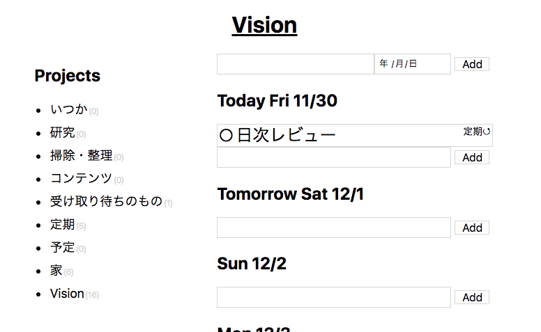

# Vision

A Todo-app written in Rails and [Ovto](https://github.com/yhara/ovto).

## Screenshot



## How to try

- git clone
- `bundle install`
- `rails db:migrate`
- `EDITOR=vim bin/rails credentials:edit` and add this:

```
vision:
  email: "foo@example.jp"
  password: "passw0rd"
```

- Then `rails db:seed`

## License

MIT

- normalize.css: https://github.com/necolas/normalize.css/blob/master/LICENSE.md
